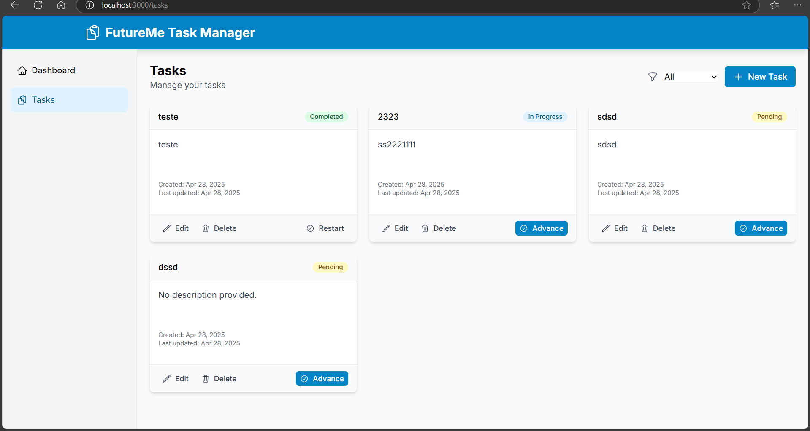
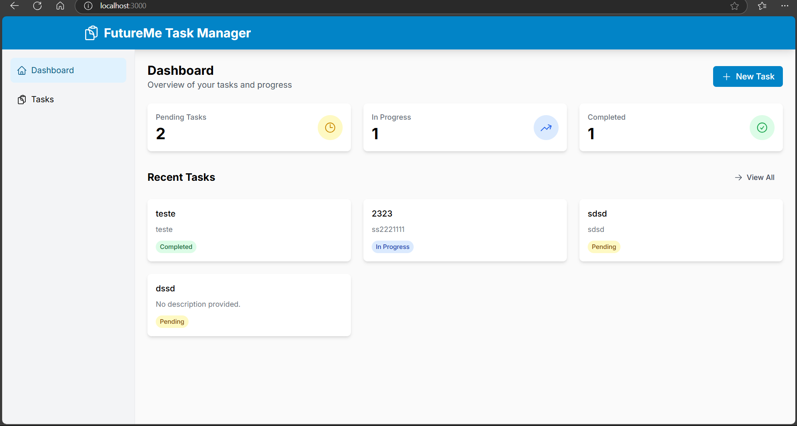
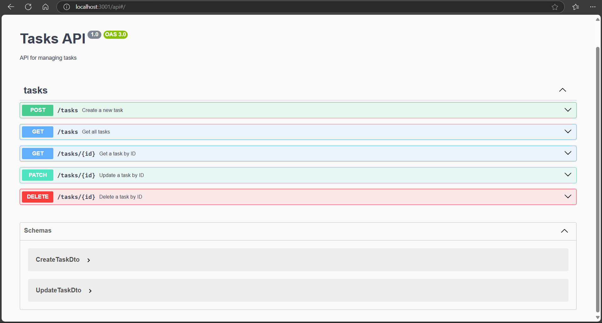
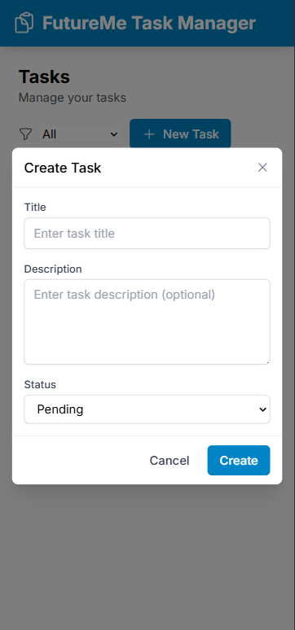
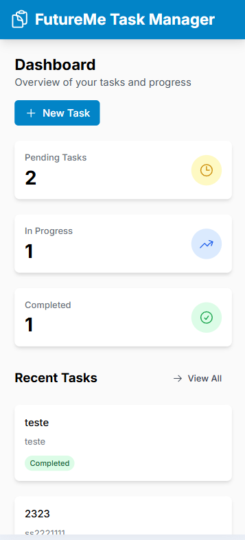

# 📌 FutureMe Task Manager

A modern and responsive task management application built with **Next.js**, **Nest.js**, and **SQLite**, all structured in a monorepo using **Turborepo**.

---

## 🚀 Features

- 📝 Create tasks with title, description, and status  
- 📋 View all tasks with filtering options  
- 🔍 View detailed task info  
- ✏️ Edit existing tasks  
- ❌ Delete tasks  
- 🔄 Track task status (pending, in progress, completed)  
- 📱 Responsive design for all devices  

---

## 🧰 Tech Stack

### 🖥️ Frontend (Next.js)

- React + TypeScript  
- Tailwind CSS  
- Heroicons  
- React Hook Form  
- Axios  

### ⚙️ Backend (Nest.js)

- TypeScript  
- SQLite (file-based database)  
- Class-validator for DTO validation  
- RESTful API architecture  

---

## 📂 Project Structure

This project is organized as a **monorepo** using **Turborepo**:

```
futureme-task-manager/
├── apps/
│   ├── web/          # Frontend (Next.js)
│   └── api/          # Backend (Nest.js)
├── packages/
│   └── database/     # Shared DB logic
├── package.json      # Root dependencies
├── turbo.json        # Turborepo config
└── README.md         # Documentation
```

---

## 🧑‍💻 Getting Started

### ✅ Prerequisites

- Node.js `16+`
- npm `7+`

### 📦 Installation

```bash
git clone https://github.com/your-username/futureme-task-manager.git
cd futureme-task-manager
npm install
```

### 📦 Installation 1

```bash
please manually delete the node_modules folder inside api, for some reason its being created and i couldn't find a solution on time
```

### 🛠️ Build the Project

```bash
npm run build
```

### 🏃 Run in Development

```bash
npm run dev
```

This will start:

- 🌐 Next.js frontend at [http://localhost:3000](http://localhost:3000)  
- 🔧 Nest.js backend at [http://localhost:3001](http://localhost:3001)

---

## 🚢 Production Setup

### 🔨 Build All Apps

```bash
npm run build
```

### 🚀 Start in Production Mode

```bash
npm run start
```

---

## 🗃️ Database

The application uses **SQLite** for data storage.

- 📁 The DB file is auto-generated at:  
  `data/tasks.db`  
- ✅ No additional configuration is needed

---

## 📡 API Endpoints

The backend exposes the following RESTful endpoints:

| Method | Endpoint       | Description             |
|--------|----------------|-------------------------|
| GET    | `/tasks`       | Get all tasks           |
| GET    | `/tasks/:id`   | Get a task by ID        |
| POST   | `/tasks`       | Create a new task       |
| PUT    | `/tasks/:id`   | Update a task           |
| DELETE | `/tasks/:id`   | Delete a task           |

---

## 📁 Folder Structure

### 🌐 Frontend - `apps/web`

```
apps/web/
├── src/
│   ├── components/   # Reusable UI elements
│   ├── lib/          # Utility functions, API clients
│   ├── pages/        # Next.js pages
│   └── styles/       # Tailwind & global styles
├── public/           # Static files
├── package.json      # Web-specific dependencies
└── next.config.js    # Configurations
```

### 🔧 Backend - `apps/api`

```
apps/api/
├── src/
│   ├── tasks/        # Task module: controller, service, DTOs
│   ├── app.module.ts # App root module
│   └── main.ts       # Entry point
├── package.json      # Backend dependencies
└── tsconfig.json     # TypeScript config
```

### 🛢️ Shared Database Package - `packages/database`

```
packages/database/
├── src/
│   └── index.ts      # DB logic and helpers
├── package.json      # Shared dependencies
└── tsconfig.json     # TypeScript config
```


### 🛢️ Project images 







---

## ✅ Summary

The **FutureMe Task Manager** is built to offer a streamlined task management experience with a focus on:

- ✨ Clean UI
- 🧱 Modular architecture
- 🏗️ Monorepo scalability
- 💡 Best practices in full-stack development

---

